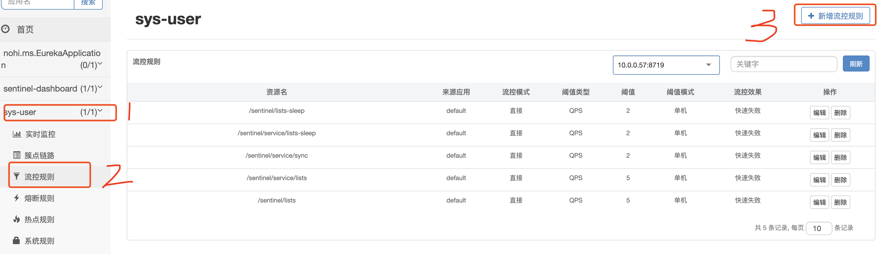

# SpringCloud2022
> create by nohi 20220711
Just demo for Spring Cloud

# spring cloud

> create by nohi 20220708

## 参考资料

* 微服务是什么 http://c.biancheng.net/springcloud/micro-service.html

- 第一代实现：Spring Cloud Netflix
- 第二代实现：Spring Cloud Alibaba

Spring Cloud 包括 Spring Cloud Gateway、Spring Cloud Config、Spring Cloud Bus 等近 20 个服务组件，这些组件提供了服务治理、服务网关、智能路由、负载均衡、熔断器、监控跟踪、分布式消息队列、配置管理等领域的解决方案。

* springboot 版本：https://spring.io/projects/spring-cloud

## 环境参数

* jdk 8 -> 17


## Eureka

> Eureka.md

## Swagger3

> 参考：SpringBoot 2.7.1整合Swagger3.0 https://blog.csdn.net/weixin_48687496/article/details/125847501
>
> 代码：SwaggerConfig.springfoxHandlerProviderBeanPostProcessor 解决swagger在springboot2.7以后的空指针异常


## Ribbo

> Spring Cloud Ribbon 是一套基于 Netflix Ribbon 实现的客户端负载均衡和服务调用工具
>
> Netflix Ribbon 是 Netflix 公司发布的开源组件，其主要功能是提供客户端的负载均衡算法和服务调用。Spring Cloud 将其与 Netflix 中的其他开源服务组件（例如 Eureka、Feign 以及 Hystrix 等）一起整合进 Spring Cloud Netflix 模块中，整合后全称为 Spring Cloud Netflix Ribbon。

### 负载均衡

* #### 服务端负载均衡

    * 需要建立一个独立的负载均衡服务器。
    * 负载均衡是在客户端发送请求后进行的，因此客户端并不知道到底是哪个服务端提供的服务。
    * 可用服务端清单存储在负载均衡服务器上。

* #### 客户端负载均衡

    * 负载均衡器位于客户端，不需要单独搭建一个负载均衡服务器。
    * 负载均衡是在客户端发送请求前进行的，因此客户端清楚地知道是哪个服务端提供的服务。
    * 客户端都维护了一份可用服务清单，而这份清单都是从服务注册中心获取的。

## OpenFeign

> OpenFeign 全称 Spring Cloud OpenFeign，它是 Spring 官方推出的一种声明式服务调用与负载均衡组件，它的出现就是为了替代进入停更维护状态的 Feign。
>
> OpenFeign 是 Spring Cloud 对 Feign 的二次封装，它具有 Feign 的所有功能，并在 Feign 的基础上增加了对 Spring MVC 注解的支持，例如 @RequestMapping、@GetMapping 和 @PostMapping 等。


## Hystrix

> 2018 netflix 宣布 Hystrix、Ribbon、Zuul、Eureka等进入维护状态，不再进行新特性开发，只修 BUG
>
> 替代方案：sentinel

* 在微服务系统中，Hystrix 能够帮助我们实现以下目标：

    - **保护线程资源**：防止单个服务的故障耗尽系统中的所有线程资源。

    - **快速失败机制**：当某个服务发生了故障，不让服务调用方一直等待，而是直接返回请求失败。

    - **提供降级（FallBack）方案**：在请求失败后，提供一个设计好的降级方案，通常是一个兜底方法，当请求失败后即调用该方法。

    - **防止故障扩散**：使用熔断机制，防止故障扩散到其他服务。

    - **监控功能**：提供熔断器故障监控组件 Hystrix Dashboard，随时监控熔断器的状态。

* Hystrix 会在以下场景下进行服务降级处理：

    - 程序运行异常

    - 服务超时

    - 熔断器处于打开状态

    - 线程池资源耗尽

* 依赖

  ```
  <!--hystrix 依赖-->
  <dependency>
    <groupId>org.springframework.cloud</groupId>
    <artifactId>spring-cloud-starter-netflix-hystrix</artifactId>
  </dependency>
  ```

## Sentinel

* 依赖

  ```
  <dependency>
      <groupId>com.alibaba.cloud</groupId>
      <artifactId>spring-cloud-starter-alibaba-sentinel</artifactId>
      <version>2.2.1.RELEASE</version>
  </dependency>
  ```

* FeignClient 服务降级

    * FeignClient

      ```
      @FeignClient(value = "SYS-USER", fallback = UserFeignFallback.class)
      public interface UserFeignApi {
          @RequestMapping(value = "/user/lists", method = RequestMethod.GET)
          List<UserDTO> lists();
          @RequestMapping(value = "/user/lists-sleep", method = RequestMethod.GET)
          List<UserDTO> listsSleep(@RequestParam("sleep") Integer sleep);
      }
      ```

    * fallback

      ```
      public class UserFeignFallback implements UserFeignApi{
          @Override
          public List<UserDTO> lists() {
              return new ArrayList<>();
          }
          @Override
          public List<UserDTO> listsSleep(Integer sleep) {
              return this.lists();
          }
      }
      ```

    * 当feignclient调用失败时，自动进入UserFeignFallback对应方法

### 使用

#### sentinel -> 自定义规则

* 初始化规则

  ```
  @PostConstruct
  public void initRule() {
    List<FlowRule> ruleList = new ArrayList<>();
    FlowRule rule = new FlowRule();
    // 设置资源名称
    rule.setResource(RESOURCE_LISTS); // "/sentinel/lists"
    // 指定限流模式为QPS
    rule.setGrade(RuleConstant.FLOW_GRADE_QPS);
    // 指定QPS限流阈值
    rule.setCount(5);
    ruleList.add(rule);
    // 加载该规则
    FlowRuleManager.loadRules(ruleList);
  ```

* 降级、失败方法

  ```
  public class HanlderExpection {
      /**
       *   返回类型和参数必须与原函数返回类型和参数一致
       */
      public static List<UserDTO> AllHandlerExpection(BlockException exception) {
          log.warn("===========AllHandlerExpection==========");
          return Lists.newArrayList();
      }
  }
  public class ClientFallBack {
      public static List<UserDTO> fallBack() {
          log.warn("fallBack");
          return Lists.newArrayList();
      }
  }
  ```


* 定义资源

  ```
  @SentinelResource(value = RESOURCE_LISTS,
              // 限流
              blockHandlerClass = HanlderExpection.class,
              blockHandler = "AllHandlerExpection",
              // 失败
              fallbackClass = ClientFallBack.class,
              fallback = "fallBack")
  ```

#### sentinel -> dashboard不回规则



### TODO

* 各种规则详解

* 通过配置自动增加规则

* Gateway + sentinel


## Gateway

API 网关是一个搭建在客户端和微服务之间的服务，我们可以在 API 网关中处理一些非业务功能的逻辑，例如权限验证、监控、缓存、请求路由等。

API 网关就像整个微服务系统的门面一样，是系统对外的唯一入口。有了它，客户端会先将请求发送到 API 网关，然后由 API 网关根据请求的标识信息将请求转发到微服务实例。

### Spring Cloud Gateway

Spring Cloud Gateway 是 Spring Cloud 团队基于 Spring 5.0、Spring Boot 2.0 和 Project Reactor 等技术开发的高性能 API 网关组件。Spring Cloud Gateway 旨在提供一种简单而有效的途径来发送 API，并为它们提供横切关注点，例如：安全性，监控/指标和弹性。 Spring Cloud Gateway 是基于 WebFlux 框架实现的，而 WebFlux 框架底层则使用了高性能的 Reactor 模式通信框架 Netty。

### 核心概念

Route（路由）： 网关最基本的模块。它由一个 ID、一个目标 URI、一组断言（Predicate）和一组过滤器（Filter）组成。

Predicate（断言）： 路由转发的判断条件，我们可以通过 Predicate 对 HTTP 请求进行匹配，例如请求方式、请求路径、请求头、参数等，如果请求与断言匹配成功，则将请求转发到相应的服务。

Filter（过滤器）： 过滤器，我们可以使用它对请求进行拦截和修改，还可以使用它对上文的响应进行再处理。

### 动态路由

```
spring:
  cloud:
    gateway: #网关路由配置
      routes:
        - id: sys-user   #路由 id,没有固定规则，但唯一，建议与服务名对应
#          uri: http://localhost:8001          #匹配后提供服务的路由地址
          uri: lb://SYS-USER # 动态路由
          predicates:
            #以下是断言条件，必选全部符合条件
            - Path=/user/**               #断言，路径匹配 注意：Path 中 P 为大写
            - Method=GET #只能时 GET 请求时，才能访问

访问网关7005  http://127.0.0.1:7005/user/lists            
```

### Filter 过滤器

Pre 类型、Post 类型

- GatewayFilter：应用在单个路由或者一组路由上的过滤器。
- GlobalFilter：应用在所有的路由上的过滤器


## Config

Spring Cloud Config 工作流程如下：

1. 开发或运维人员提交配置文件到远程的 Git 仓库。
2. Config 服务端（分布式配置中心）负责连接配置仓库 Git，并对 Config 客户端暴露获取配置的接口。
3. Config 客户端通过 Config 服务端暴露出来的接口，拉取配置仓库中的配置。
4. Config 客户端获取到配置信息，以支持服务的运行。

## 链路跟踪

### 功能

* 故障快速定位
* 各个调用环节的性能分析
* 数据分析
* 生成服务调用拓扑图

